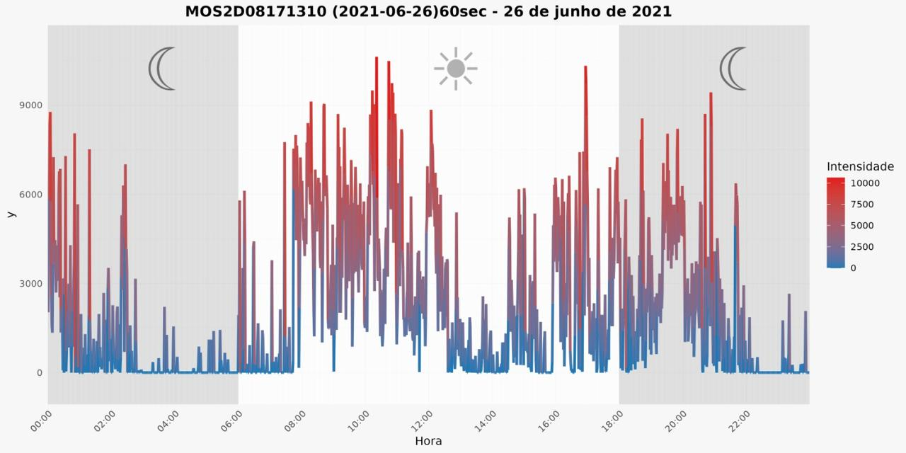
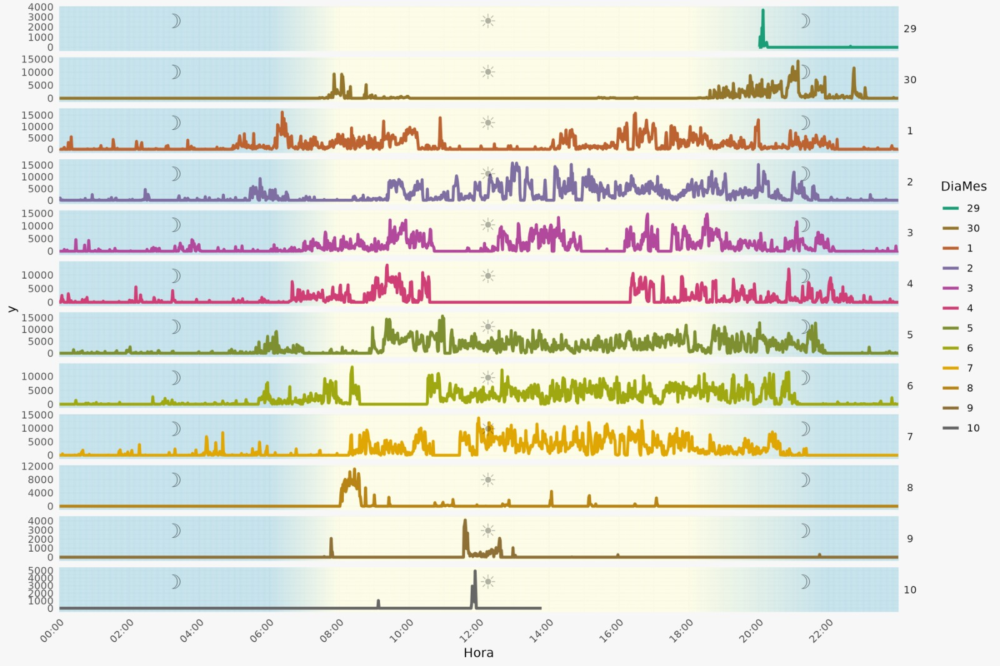
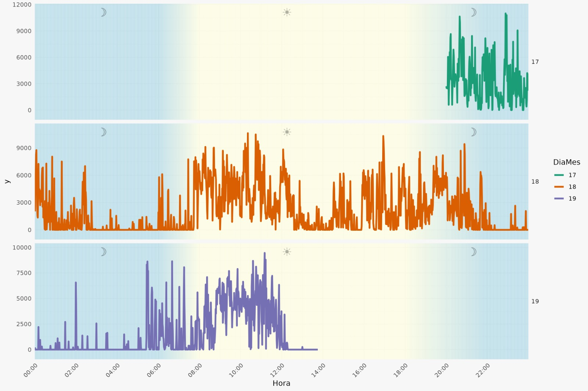

# Análise de Dados de Acelerômetros para Gestantes

Este repositório contém a análise de dados coletados de acelerômetros utilizados por gestantes. O objetivo é gerar gráficos de série temporal que visualizam a atividade física das gestantes ao longo do tempo, permitindo insights sobre o comportamento de atividade física durante a gestação.

## Estrutura do Repositório

O repositório é organizado da seguinte forma:

- **banco_dados/**: 
  - Esta pasta contém os arquivos de dados em formato `.csv` utilizados na análise. Os dados incluem informações de movimento coletadas por acelerômetros, categorizadas por dias e horários.

- **script/**: 
  - Esta pasta contém os scripts em R utilizados para gerar os gráficos de série temporal. Ela é subdividida em duas pastas principais:
  
  - **gráfico_diario/**: 
    - Contém scripts projetados para gerar gráficos diários de forma independente.
    - O script principal neste diretório cria gráficos em loop. Para cada dia encontrado nos arquivos do banco de dados, é gerada uma nova pasta na saída (`output`), onde cada gráfico correspondente ao dia é armazenado. Por exemplo, se o arquivo 1 contém dados de 10 dias, serão gerados 10 gráficos em uma pasta específica para o arquivo.

  - **gráfico_tds_dias/**: 
    - Contém scripts para gerar gráficos que apresentam todos os dias em um único gráfico.
    - **script_loop.R**: 
      - Este script gera gráficos em loop, considerando todos os dias de cada arquivo. Se o arquivo 1 possui dados de 10 dias, todos os 10 dias estarão representados em um único gráfico, e um gráfico será gerado para cada arquivo presente no banco de dados.
    - **script_individual.R**: 
      - Este script gera gráficos de forma individual, sem ser em loop. O gráfico é gerado apenas na aba de plot do RStudio, mas apresenta todos os dias em um único gráfico, semelhante ao gráfico gerado pelo script em loop.

- **outputs/**:
  - As pastas de output presentes nas pastas `gráfico_diario` e `gráfico_tds_dias` contêm os resultados dos gráficos gerados. Cada pasta de output corresponde ao respectivo script e pode conter diferentes saídas, devido às diferenças nos objetivos de cada script.

## Como Executar os Scripts

Para executar os scripts em R, siga os passos abaixo:

1. **Clone o Repositório**:
   ```bash
   git clone https://github.com/educomunaledev/gestantes-acelerometro-analisys.git
   ```

2. **Instale as Dependências**: Certifique-se de ter o R e o RStudio instalados em sua máquina. Você pode precisar instalar pacotes como `tidyverse`, `lubridate`, entre outros, que são utilizados nos scripts.

3. **Abra o RStudio**: Navegue até o diretório clonado no RStudio.

4. **Execute os Scripts**:
   - Para executar o script de gráficos diários, abra o script dentro da pasta `gráfico_diario` e execute-o.
   - Para os gráficos com todos os dias, utilize os scripts na pasta `gráfico_tds_dias` conforme desejado.

## Exemplos de Gráficos





## Contribuições

Este projeto foi desenvolvido por Eduardo.  

## Licença

Este projeto está licenciado sob a [MIT License](LICENSE).

## Contato

Para perguntas ou comentários, entre em contato:
- **Nome**: Eduardo
- **Email**: edutristaocomunale@gmail.com

